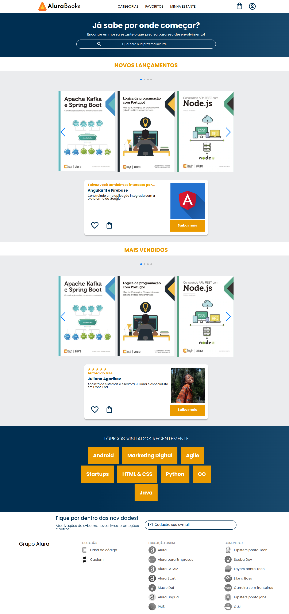
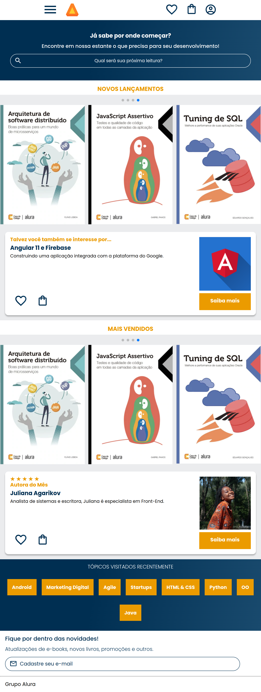
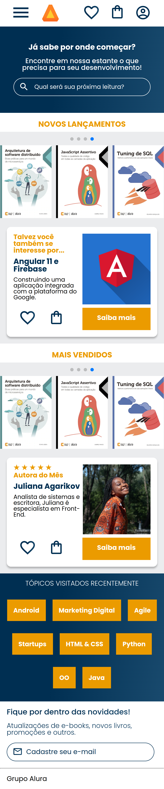

# Alura Books

Quarto projeto da formação HTML e CSS 

| :placard: Vitrine.Dev |     |
| -------------  | --- |
| :sparkles: Nome        | **Alura Books**
| :label: Tecnologias | HTML e CSS
| :rocket: URL         | https://alura-books-three.vercel.app/
| :fire: Desafio     | -

## Detalhes do projeto

Projeto de um site responsivo feito a partir de um layout publicado no Figma usando HTML e CSS. 
Esse foi o quarto projeto executado enquanto eu cursava a formação de HTML e CSS da Alura. 
Seu objetivo era colocar em prática a abordagem de responsividade com mobile-first Nesse projeto aprendi: 
 • A costumizar um "menu hambúrguer" sem JavaScript;  
• A criar um carrossel usando uma API;  
• A usar pseudo-classes e pseudo-elementos;  

## Screenshots

## Desktop

  </img>

## Tablet

  </img>

## Mobile

  </img>

